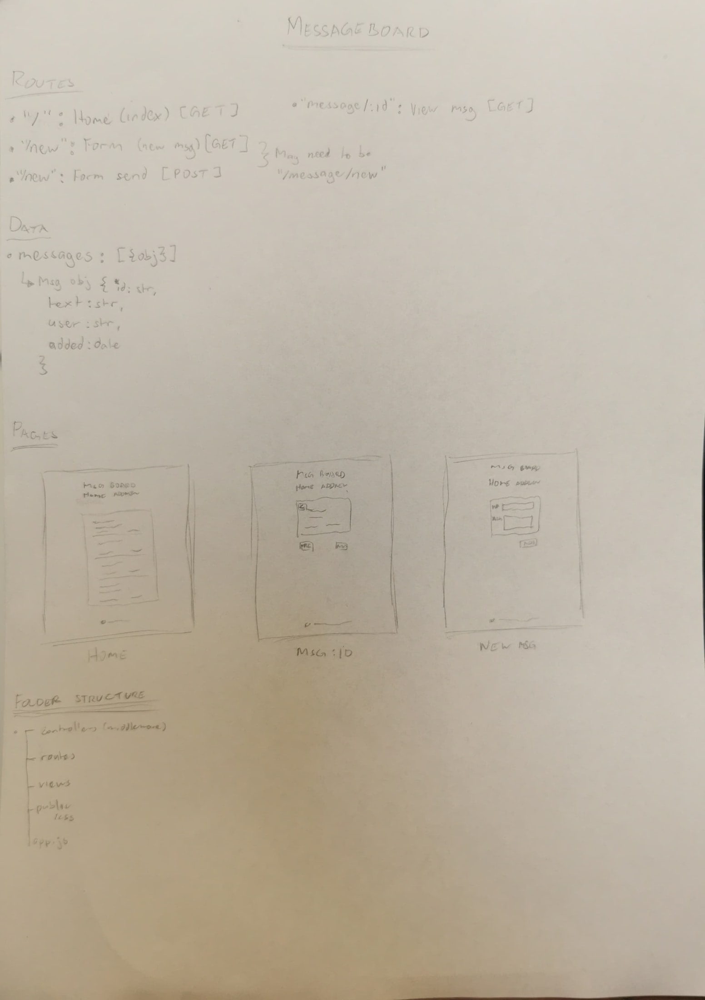

# Message Board

This repository containts a simple message board app utilising express and EJS.

## Technologies Used

- Node
- Express
- JavaScript
- EJS

## Installation

1. **Clone the repository**:

   ```bash
   git clone https://github.com/ishmyles/message-board.git
   cd message-board
   ```

2. **Install dependencies**:

   ```bash
   npm install
   ```

3. **Start the application**:

   ```bash
   node --watch app.js
   ```

   The app will be accessible at `http://localhost:3000`.

4. **Terminating the application**:

   Press Ctrl + C to terminate app.

## App Design


